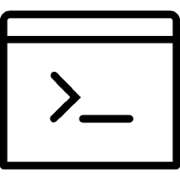

   
<h3> EUNJI KIM </h3>
<b>Machine Learning Developer</b>   
 <a href="https://github.com/KEJdev">  https://github.com/KEJdev </a>    
<a href="mailto:kej12516@gmail.com">   kej12516@gmail.com  </a>    

 

배우는 것을 좋아하는 평범한 개발자입니.
아직 개발새싹 수준이라 배우고 싶은 언어도 하고 싶은 것이 많습니다. 
오타나 불편한 소스가 있으면 조심스레 알려주신다면 더 열심히 배워보겠습니다.

저에 대해 궁금한 것이 더 있다면 [인스타](https://www.instagram.com/ao_ej125/)를 통해 <STRIKE>제 고양이를 봐주세..</STRIKE> 소통해도 좋습니다. 

<!--  

   SKILLS & PROFICIENCY

**PYTHON**

  
80%

**R**

  
80%

**JAVA**

  
60%

**SQL & PLSQL**

  
60%

**Linux**

  
50%

 -->

