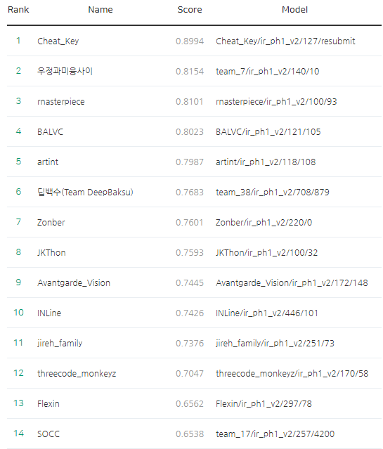

**세상에 잘하는 사람은 정말 널리고 널렸구나.** 첫 공모전에 대한 나의 느낌이다. 해커톤이라고 해서 사실 겁을 지례먹고 구석에서 부들부들거렸다. 나는 그렇게 강심장은 아니여서.

나는 **팀 운이 좋았다.**라고 밖에 이야기를 할 수가 없다. 2년정도 격주로 스터디를 다녔는데, 같이 스터디 했던 분들 중 2명과 함게 같이 해커톤에 나가게 되었다. 다행이도 네이버 해커톤을 나가본 경험이 있는 분과 함께 해서 조금은 수월했던 것 같다. 

참가 커트라인은 개인 깃허브를 보기 때문에 참가조차 하지 못하는 팀이 있다고 들었다. 난 아직 깃린이여서 혼자했다면 분명 팽~당햇을 것이라 생각한다. 

해커톤은 1차 예선, 2차 예선, 온라인 결승 그리고 오프라인 결승으로 이루어졌다. 1차에서 턱걸이로 간신히 통과하고 2차에서 드라마틱하게 탈락위기에서 마감 몇시간전에 급 14위로 다행이 위기를 벗엇다. 

오프라인 결승까지 갔지만 결국 순위권안에 들지는 못했다. 대부분 순위는 그렇게 변동이 없었기 때문에 거의 유지만 하다 싶히 했다. 오르라인 결승에서는 거의 서로 어떤 논문을 보았는지, 어떤 방식으로 했는지에 대해서 서로 애기하는 것이 많았는데, 어떤 논문을 읽고 구현하느냐에 따라 정말 많이 달라 질 수 도 있구나를 알 수 있었다. 

어떤 팀은 구글 논문을 읽고 그것과 똑같은 모델을 구현하는데 성공했고 그덕에 상위권에 있었는데 정말로 놀라웠다. 그래서인지 공모전이 끝난 후에 조금 더 노력하려고 했던 것 같았다. 

