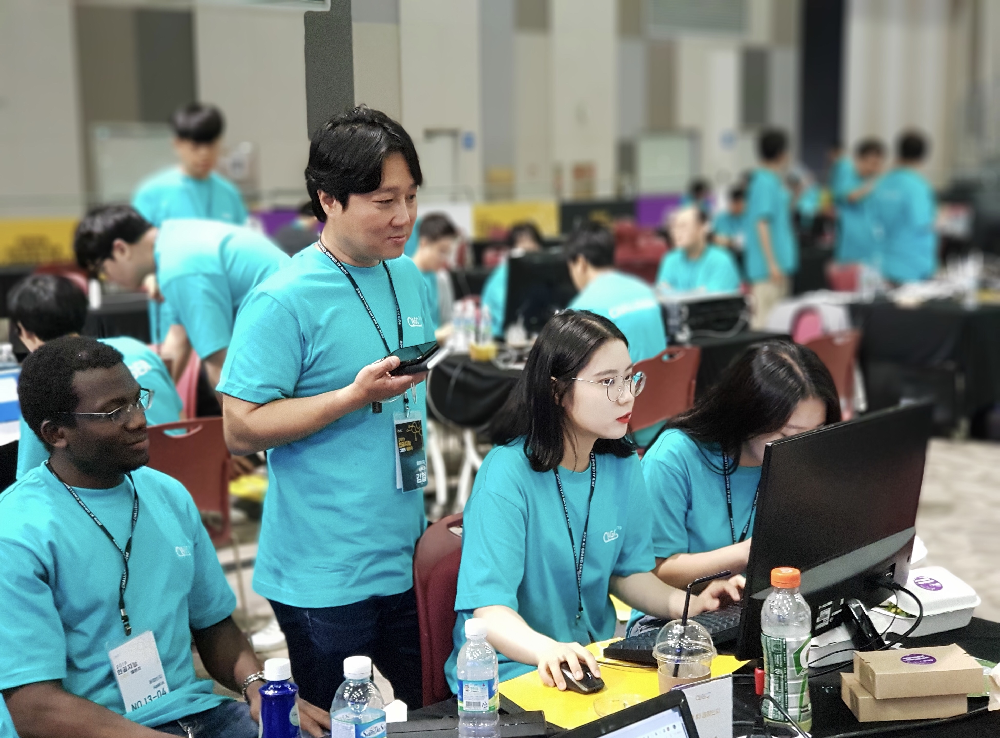

아직 도커 사용하는 법에 대해 미숙했던 때였다. 우연찮게 한양대 대학원분들과 우리 회사랑 해서 같이 인공지능 챌린지에 나갔다. 

국가 공모전은 처음이라 사실 많이 긴장 되었지만, 그전에 네이버 해커톤이나 캐글에 나간 경험으로 인해 약간의 자신감은 있었던 터라 사실 조금은 기뻤다. 

그러나 이 챌린지에 나간 것을 반은 후회한다고 이야기 할 수 있다. 아니 후회가 아니라 사실은 짜증과 스트레스라고 보면 딱 일것이다. 

이렇게까지 인공지능에 대해 개념?이 없다라고 해야댈지 아니면 까다롭다고 해야댈지 사실 잘모르겠다. 

대회가 열리기까지 정말 많은 사건사고가 있던거 같다. 제대로 된 공지도 하지 않았고, 대회 일자가 갑자기 미뤄진 이유가 대학생들 시험기간이라고 편의를 위해 미뤘다면서 이야기 한다거나, 데이터도 제대로 된 것을 제공하지 않았다. 

그래서 중간에 설명회 열렸을 때, 기관과 공모전 참여자들의 엄청난 싸움이 있었다. 정말 말 그대로 개판이였고 월래 이렇게 다들 싸우나 싶을 정도였다. 

대회가 열리는 그 순간까지 참가자들의 많은 욕을 들었던 것 같다. 

 
도커 이야기를 앞에서 했던 이유는 제출 형식이 도커파일이였는데, 도커를 사용할 줄 모르는 사람들이 많은 항의를 했기 때문이다. 아무튼 그덕에 나도 도커기술을 어떨결에 습득하게 되었는데, 지금은 업무때문에 자주 사용하게 되서 괜찮지만, 그 당시에는 너무 힘들었던 기억이 난다. 

대회장에서도 인터넷을 사용할 수 없도록 해놨기 때문에 더욱이 도커를 사용해야만 했으며, 대회 내부적으로 사용하는 프로그램이 있어서 json형식으로 결과물을 제출해도 프로그램이 파일을 읽지 못한다면, 그냥 0점처리 되는 체계였다.

그덕에 우리팀 파일도 해당 대회에서 파일을 읽지못해 0점처리가 되었고, 많은 팀들이 0점 처리 되어 대회가 끝난 후 항의도 만만찮게 왔다. 

이 대회를 하면서 느꼈던건 국가 대회라고 해서 시스템이 잘되어 있을꺼라 생각하지는 말것과 팀원들과의 많은 소통을 하지 못해서 더 좋은 결과를 뽑아내지 못했다는 아쉬움뿐이다. 
