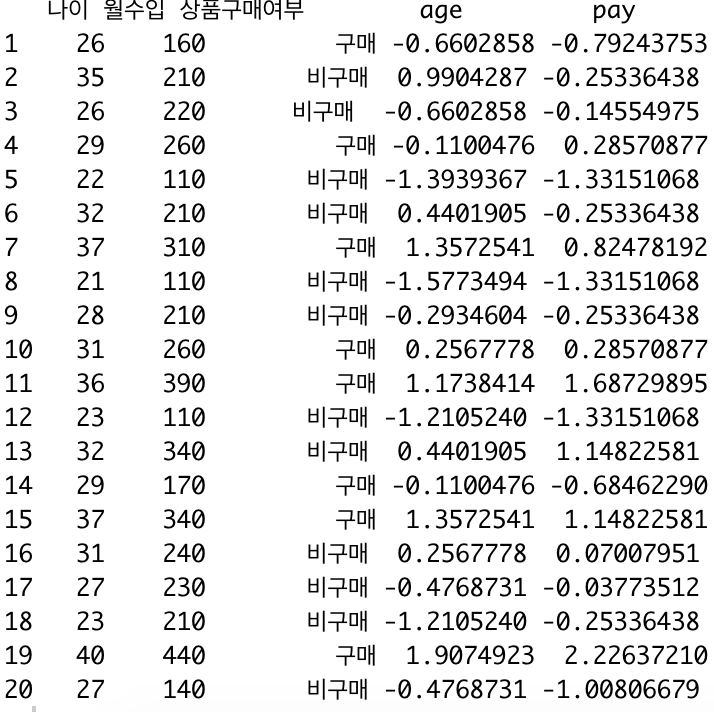

knn을 사용하여 조금 의미 있는 결과를 가지고 재밌는 결과를 뽑아내보도록 하겠습니다. 데이터는 [여기](https://github.com/KEJdev/DataSet)에서 데이터를 다운 받아주세요.

-------

### DataSet  

이번 데이터를 열어보면 나이, 월수입, 상품 구매여부, 나이가 있습니다. 이 데이터를 이용해, 백화점 또는 소셜커머스 회사에서 데이터 분석을 통해 구매자가 제품을 구매할 고객인지 아닌지를 알아내려고 한다고 가정해보고 knn을 이용하여 문제를 풀어보도록 하겠습니다.  


-------


### nomalize (정규화)

우선 데이터를 불러옵시다.  

```r
buy<-read.csv("buy.csv",fileEncoding = "euc-kr") 
```

뒤에 붙어 있는 Encoding은 따로 환경설정해서 해주셨다면 안하셔도 됩니다. 저 같은 경우 현재 맥북을 사용하고 있어서 뒤에 Encoding처리를 따로 해주었습니다. 불러온 데이터는 아래와 같습니다.  


<center></center>  


이 데이터에서 scale함수를 이용하여 나이 컬럼을 정규화 해주겠습니다. 특정 컬럼을 가져와서 정규화 하려면 아래와 같이 하면 됩니다.  

```r
buy$age <- scale(buy$나이)
```


<center></center>  


뒤에 age컬럼이 추가와 동시에 정규화 된 컬럼이 추가가 된 것을 확인할 수 있습니다. 계속해서 월수입도 함께 정규화 시키겠습니다. 정규화를 하는 이유에 대해서는 저번 포스팅에서 이야기를 했기 때문에 만약 정규화를 왜 해야하는지 의문점이 든다면, 저번 포스팅을 확인해주세요.  

```r
buy$pay <- scale(buy$월수입)
```

아까와 똑같이 정규화를 해주세요.  


<center></center>  


위와 같이 컬럼이 또 추가 된 것을 확인 할 수 있습니다. 그럼 이제 knn을 이용하여 구매분류를 해보겠습니다.

-------

### knn 구매여부 분류하기   
 


```r
train_data<-buy[,c(4,5)]
train_label<-buy[,3]
```

첫번째 줄은 4, 5번째 컬럼만 따로 train_data이라는 변수에 담겟다는 의미입니다. 두번째 줄은 3번째 컬럼만 train_label이라는 변수에 담겠다는 의미입니다. 이번엔 test data를 만들어보겠습니다.

```r
test_data <- data.frame(age=44, pay=400)
```

나이가 44살에 월급이 400이라는 데이터를 하나 만들었습니다. 여기서 **주의!** test data도 마찬가지로 정규화를 해주어야 결과값을 볼 수 있습니다. test data도 정규화 작업을 한 후에 knn을 해주세요. test data도 정규화 했다고 치고, 결과를 출력해 보겠습니다.  

```r
result <-(test_data, test_data, train_label , k=5, prob =TRUE)
```

 
출력하면 "구매"라는 결과를 볼 수 있습니다.  
knn는 과일 분류를 해보겠습니다. 주제는 토마토가 야채인지, 과일인지에 대해 분류를 해보겠습니다. 포스팅 한 코드는 [여기](https://github.com/KEJdev/R-Example)에서 전체 코드를 볼 수 있습니다.  


