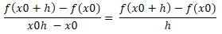
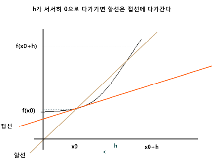
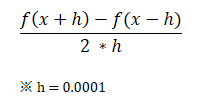
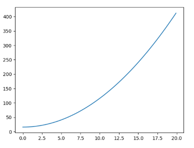
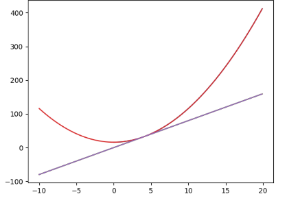

신경망이라는 것을 접하면서 미분, 기울기와 같은 말을 몇번 들어봤습니다.우리는 왜 미분을 사용하는 것인지, 미분이 필요한 이유와 도함수를 Python 으로 간단하게 구현해보도록 하겠습니다.


-------


### 미분이 필요한 이유  

미분이 필요한 이유는 **기존의 가중치를 갱신하기 위해서 사용**합니다.  
하지만 진정한 미분은 컴퓨터로 구현하기 어렵기 때문에 중앙 차분 오차가 발생합니다. 그래서 컴퓨터로 미분을 구현하기 위해서는 수치 미분을 사용해야 합니다.  

예를 들어보겠습니다.  
함수 $$y=f(x)$$에 대해서 $$x$$가 $$x_{0}$$ 에서 $$x_{0}+h$$ 로 변화할 때, $$y$$의 값은 $$f(x_{0}+h)$$로 변화한다고 할 때, 평균 변화율은 아래와 같습니다.  

<center></center>  


그림을 보면 h가 서서히 0으로 다가가면 할선은 접선으로 다가갑니다. 


<center></center>  


이를 코드로 구현하려면 h가 되었을때가 진정한 미분이라고 할수 있는데, 아까 말했던 것과 같이 컴퓨터로는 진정한 미분을 구현하는 것은 어렵습니다. $$h$$가 0이 될 수 없기 때문이며, 그래서 $$h$$를 0.0001로 두고 수치미분을 합니다.  

식은 아래와 같습니다.  

<center></center>  


-------


### 수치 미분

함수 이름은 numerical_diff 라고 짓겠습니다. 위의 공식을 보고 그대로 만들면 되기 때문에 간단하게 함수를 구현할 수 있습니다.  

```python 
def numerical_diff(f,x):
    h=0.001
    return (f(x+h)-f(x-h)) / (2*h)
```

위의 미분 함수를 이용하여 $$f(x)=x^2 + 4^2$$ 함수를 미분하고 $$x=4$$에서의 미분계수(기울기)를 구해보겠습니다. $$2x + 0$$ 상수는 도함수가 되면 0이 되고, 2*4 = 8 이 됩니다. 

```python
def samplefunc1(x):
    return x**2 + 4**2

print(numerical_diff(samplefunc1,4))
```

결과 값을 출력하면 8이 나오지 않고 근사치가 나오는 것은 수치미분이기 때문에 중앙 차분 오차가 발생하기 때문입니다. 

```python
import numpy as np
import matplotlib.pylab as plt

def samplefunc1(x):
    return x**2 + 4**2

x = np.arange(0.0, 20.0, 0.1) 
y = samplefunc1(x)
plt.plot(x,y)
plt.show()
```

<center></center>  

여기에 도함수 그래프를 넣어 겹쳐서 보겠습니다.  

```python
import numpy as np
import matplotlib.pylab as plt

def numerical_diff(f,x):
    h=0.001
    return (f(x+h)-f(x-h)) / (2*h)

def samplefunc1(x):
    return x**2 + 4**2

def afterfunc(x):
    return numerical_diff(samplefunc1,4)*x

x1 = np.arange(-10.0, 20.0, 0.1) 
y1 = samplefunc1(x1)
plt.plot(x1,y1)

x2= np.arange(-10.0, 20.0, 0.1) 
y2 = afterfunc(x2)
plt.plot(x2,y2)

plt.show()
```


<center></center>  


