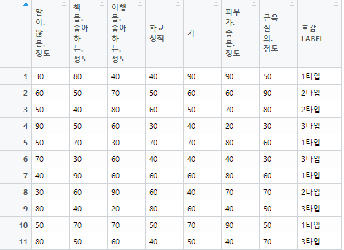
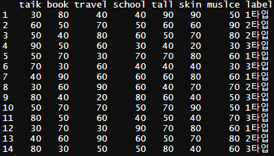

knn 분류 예제를 보면서 공부해보도록 하겠습니다. 포스팅에서 사용된 데이터는 [여기](https://github.com/KEJdev/DataSet)에서 데이터를 다운 받아주세요.

-------

###  Dataset  

데이터 설명을 하자면, 소개팅을 수천번하지 않기 때문에 그동안 14번정도 소개팅을 했다고 가정하고 만난 남학생들에 대한 라벨을 호감라벨로 만들었습니다. 14개의 데이터를 knn으로 학습시켜서 예측 모델을 생성하고, 새로 만나게 될 남학생에 대한 데이터로 이 학생의 호감 라벨을 예측해보려고 합니다.  

머신러닝을 할 때는 필수적으로 데이터 전처리라고 하는 Input 데이터를 알고리즘에 맞게 잘 정재하는 작업이 필요합니다. 이것을 표준화 또는 정규화 작업이라고도 합니다.  

데이터 양이 작을 경우에는 scale() 이란 함수를 사용합니다.  
**<center> 음수 ~ 양수 </center>**  


반대로 데이터의 양이 많을 경우에는 nomalize() 이란 함수를 사용합니다.  
**<center> 0 ~ 100 </center>**

-------

### 왜 표준화나 정규화를 해야하는가? 

어떤 데이터는 cm이고 어떤 데이터는 kg이면 결과가 제대로 나올수가 없습니다. 그래서 cm이던 kg이던 0~100 사이의 데이터로 일관되게 만드는 작업이 필요합니다. 정규화 공식을 쉽게 보면 아래와 같습니다.  


<center>값 - 평균값 </center>
<center>------------------</center>
<center>표준편차</center>  


-------


### knn Example

R에서 csv파일을 불러올때는 아래와 같이 하면 불러올 수 있습니다.  

```r
like<-read.csv("like.csv", header = T)
```  

출력하면 아래의 데이터가 나오는 것을 확인할 수 있습니다. 

<center></center>  


한글 컬럼명이 생각보다 불편한거 같습니다. 컬럼명을 바꿔보겠습니다. 컬럼명은 아래와 같이 입력하면 바꿀 수 있습니다.  

```r
colnames(like)<- c( "taik" ,"book" ,"travel", "school" ,"tall" ,"skin", "muslce" ,"label")
```  
  
출력하면 아래와 같이 컬럼명이 변경되어 나오는 것을 확인할 수 있습니다.  

<center></center>  
 

이제 knn을 이용해서 분류를 하려고 하는데 맨 끝 컬럼에 있는 label과 data를 분리해야합니다. 분리는 아래와 같이 하시면 컬럼을 분리하실 수 있습니다.   

```r
train_data<-like[,-8]
train_label<-like[,8]
```

[,-8]은 8번째 컬럼을 제외하고 라는 뜻이고, [,8]는 8번째 컬럼만 이라는 뜻이예요. 이제 진짜 knn을 사용해서 분류를 하려고 하는데 간단하게 test 데이터를 만들고 분류를 해보겠습니다. 여기서 test data는 위에서 언급했듯이 새로 만나게 될 사람에 대한 호감 라벨을 알아보기 위한 데이터입니다. 데이터를 생성을 위해 아래의 코드를 넣어 데이터를 생성해주세요.  

```r
test.data<-data.frame(talk=70, book=50,travel=30,school=70, tall=70, skin=40,muslce=50)
```  

데이터를 넣었으면, 이제 knn분류를 해보겠습니다. 아래와 같이 코드를 작성해주세요.  

```r
library(class)
result<- knn(train_data, test.data, train_label, k=3 , prob=TRUE)
```

그리고 출력하면 3타입이라는 결과를 얻을 수 있습니다. 그렇다면 위의 모델을 다시 생성하는데, k값을 다르게 했을때, 호감 라벨이 어떻게 변화하는지 확인해보세요.  

여기서 **주의** 해야할 점은 k값이 너무 크면 분류를 잘못하고 k값이 너무 작으면 테스트 데이터에만 너무 익숙해져요. 그러면 나중에 새로운 데이터를 분류할때, 분류를 잘 못하는 현상이 일어나는데, 이것을 **오버피팅**이라고 합니다. 머신러닝 관련 단어 부분은 따로 다룰테니, 나중에 포스팅을 참고 해주세요. R에 대한 전체 코드는 [여기](https://github.com/KEJdev/R-Example)에서 볼 수 있습니다. 


