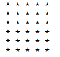

---
layout: post
current: post
cover:  ../assets/images/python_cover1.png
navigation: True
title: Python for문 개념 ①
date: 2019-12-01 09:00:00
tags: [PYTHON]
sitemap :
  changefreq : daily
  priority : 1.0
class: post-template
subclass: 'post tag-python'
author: KEJdev
use_math: true
---  


반복문은 어떤 언어라고 할 것도 없이 정말 중요하고, 자주 쓰이는 문법입니다. 특히나 for문은 더욱 더 그렇죠. 그럼 오늘은 간단하게 for문의 기본적인 구조와 별찍기를 해보겠습니다 .

<br>  


> #### for

파이썬의 for 문의 기본적인 구조는 아래와 같습니다.  

<center></center> 


for문은 리스트나 튜플, 문자열의 첫번째 요소부터 마지막 요소까지 차례로 변수에 대입되어 "수행할 문장1", "수행할 문장2"등이 수행됩니다. 

그래서 조금 더 자세하게 문법을 설명하자면, 아래와 같습니다.  


```python
# for "반복변수" in "순서열" : 
#       ↑ 
#     "리스트, 튜플, 딕셔너리"
#        []    ()      {}
# "실행문"
```
<center></center> 

예제를 보면서 설명해보겠습니다.  
숫자 1부터 3까지를 for문을 이용하여 출력해보겠습니다. 

```python
for i in (1,2,3):
  print(i)
```

잘 나왔나요 ?   
이번에는 문자열도 for문으로 돌려보겠습니다.  

```python
for i in 'i like tteokbokki':
  print(i)
```

재밌죠? 생각보다 어렵지도 않습니다.  
그렇다면 이번에 좀 더 range라는 것을 사용하여 2씩 증가하도록 출력해보도록 하겠습니다.  

```python
for i in range(1,11,2): # 1부터 10까지 증가하는데, 2씩 증가시켜라
  print(i)
# 출력 결과 1,3,5,7,9
```

range는 자주 사용하니, 사용법을 익혀 두는 것이 좋습니다. 그러면 range를 사용하여, 컴공들이 자주 찍는다는 별찍기를 해보도록 하겠습니다. 아래와 같이 별을 찍으려면 어떻게 찍어야 댈까요 ? 

<center></center>  


```python
a=str("★")

for i in range(1,11):
  print(a*i)
``` 

또는 

```python
for i in range(1,11):
  print("★"*i)
``` 

이런식으로 작성하시면 됩니다.  
그렇다면 이번에 반대로 별을 찍어볼까요?

<center></center> 

이렇게 별을 찍으러면 어떻게 해야댈까요 ? 
이것도 간단하게 아래와 같이 작성하면 됩니다.  

```python
a=str("★")

for i in range(10,0,-1):
    print(a*i)
```


그럼 이번엔 조금 더 재밌는 for문을 작성해볼까요 ? ★으로 사각형을 만들어보겠습니다.
단, 이번에는 가로/세로를 입력을 받아서 ★를 출력하되, 중첩 for문을 사용하지 않고 작성해보도록 하겠습니다.  

<center></center> 


```python
a=int(input("가로의 숫자를 입력하세요 "))
b=int(input("세로의 숫자를 입력하세요 " ))

for i in range(b):
  print("★"*a)
```

어때요 ? 간단하죠 ? 그렇다면 중첩 for문을 작성하여 사용하려면 어떻게 해야댈까요?

```python
for i in range(b):
    c = ' ' # 초기화
    for j in  range(a):
        c += '★ '
    print(c)
```

크으... 저 더러운 코ㄷ.. 아, 잘하셨습니다. 
마지막으로 가장 기본인 구구단을 출력해볼까요 ?  
구구단을 가로로 출력하면 아래와 같습니다.  


```python 
for i in range(1,10):
    result = ' '
    for j in range(2,10):
        result += (str(j) + 'X'+ str(i) + '=' 
        + str(i*j).ljust(13))
  print(result)
```

또는 

```python
for i in range(1,10):
    result = ' '
    for j in range(2,10):
        result += (str(j) + 'X'+ str(i) + '=' 
        + str(i*j) + \'t' )
  print(result)
```

이렇게 코드를 작성하실 수 있습니다. 도움이 되셨나요 ?  
다음 포스팅 땐 if문과 for 문을 섞어서 사용하는 것에 대하여 알아보도록 하겠습니다. 