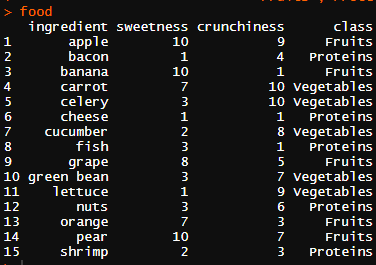
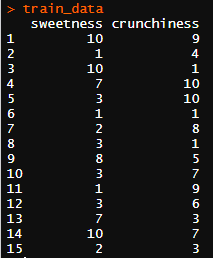
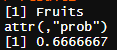

오늘은 조금 재미있는 데이터를 가져와봤습니다. 토마토가 야채인지, 과일인지, 단백질인지를 knn을 통하여 분류해서 알아내는 작업을 해보겠습니다. 이번 포스팅에서 사용 되는 데이터는 아래에서 데이터를 직접 만들어서 작성 할 거라서, 따로 다운 받으실 필요는 없습니다. 

-------


### DataSet 

데이터는 아래와 같습니다. 과일은 사과, 바나나, 당근, 치즈 등 작지만 다양한 데이터 입니다.

```r
food <- data.frame(ingredient = c("apple", "bacon", "banana", "carrot",
                                  "celery", "cheese", "cucumber", "fish",
                                  "grape", "green bean", "lettuce",
                                  "nuts", "orange", "pear","shrimp"),
sweetness = c(10,1,10,7,3,1,2,3,8,3,1,3,7,10,2),
crunchiness = c(9,4,1,10,10,1,8,1,5,7,9,6,3,7,3),
class = c("Fruits","Proteins","Fruits","Vegetables",
          "Vegetables","Proteins","Vegetables",
          "Proteins","Fruits","Vegetables",
          "Vegetables","Proteins","Fruits",
          "Fruits","Proteins"))
```

출력하면 아래와 같이 출력이 됩니다.  


<center></center>  


그럼 이제 토마토 데이터를 만들어 보겠습니다. 토마토 데이터는 아래와 같이 만들어주면 된답니다.  

```r
tomato <- data.frame(sweetness = 6, crunchiness = 4)
```

-------


### knn 

food 에서 2번째 컬럼과 3번째 컬럼을 train 데이터로 사용하겠습니다. 

```r
train_data <- food[,c(2,3)]
```


<center></center>  


그리고 라벨은 데이터의 마지막 컬럼인 class 입니다. 그래서 아래와 같이 라벨을 따로 변수에 담아주겠습니다.  


```r
train_label<-food[,4]  
```
 
그럼 이제 바로 토마토를 넣어서 knn을 해보겠습니다.  

```r
library(class) 
result1<-knn(train_data,tomato ,train_label, k=3, prob=TRUE)
```


<center></center>  


이번 knn은 조금 재밌지 않나요 ? 다음 포스팅에서는 knn을 이용한 동물 분류해보도록 하겠습니다.    
전체 코드는 [여기](https://github.com/KEJdev/R-Example)에서 확인하실 수 있습니다.  


