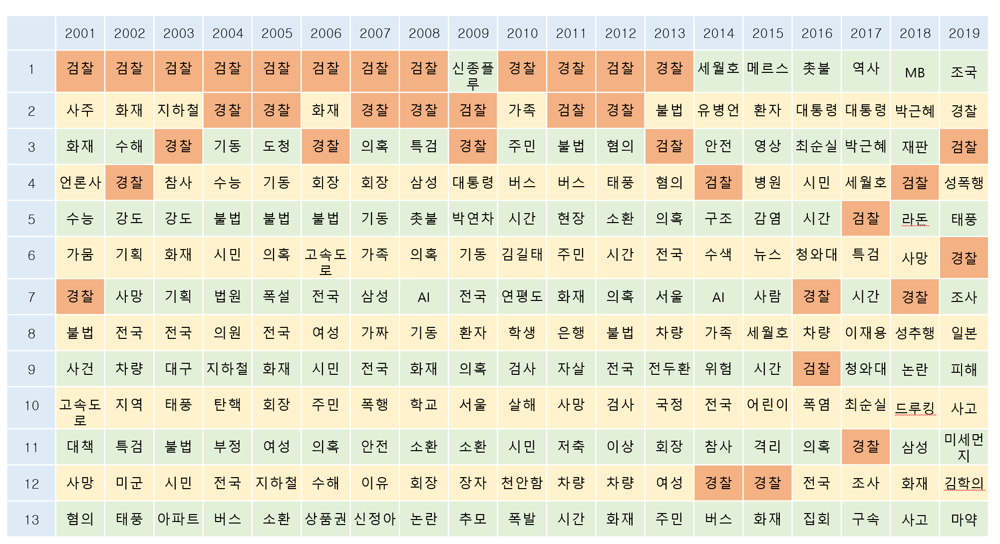
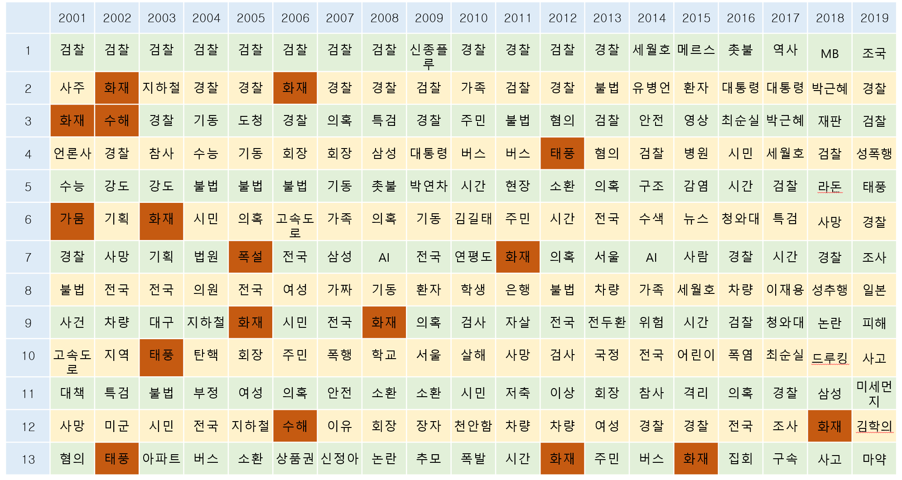
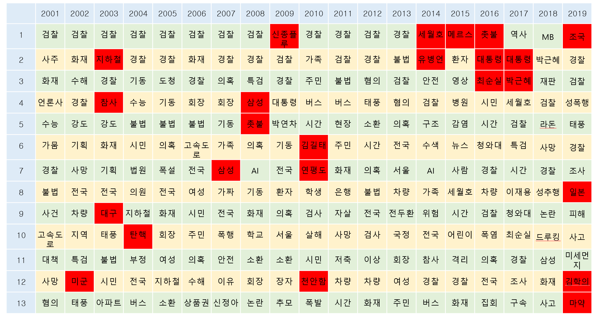
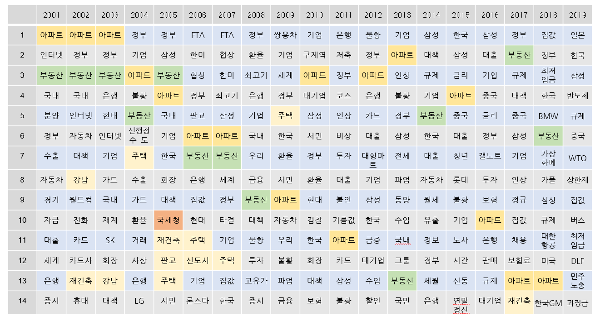
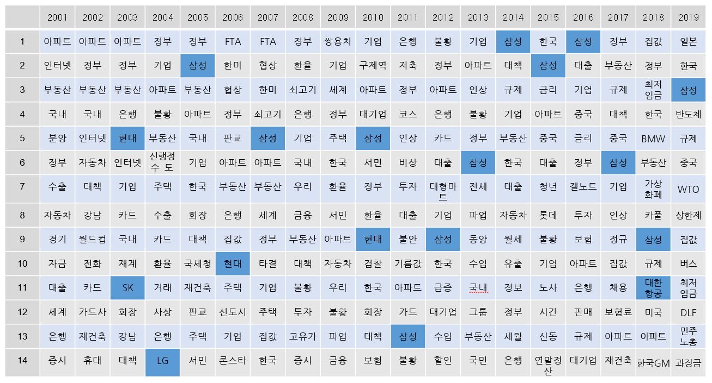
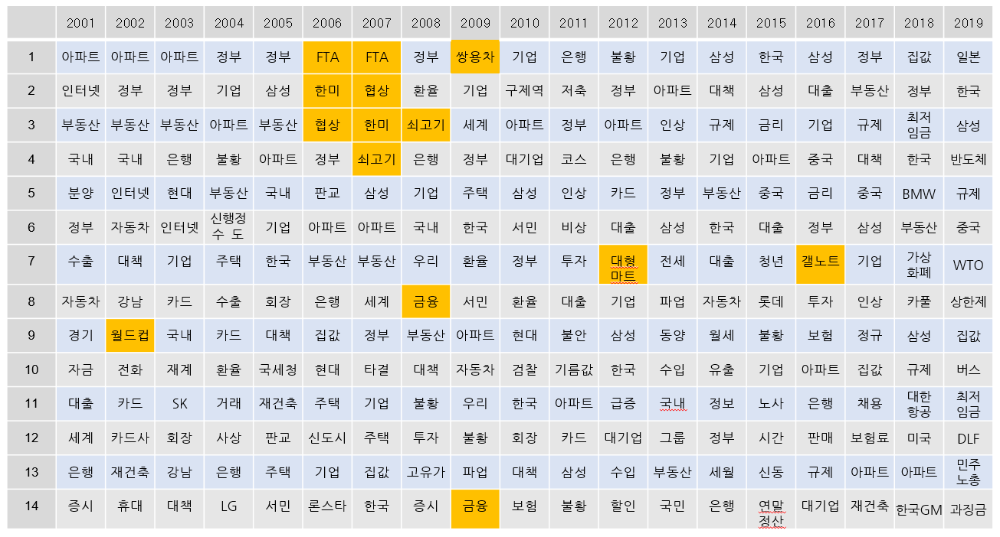
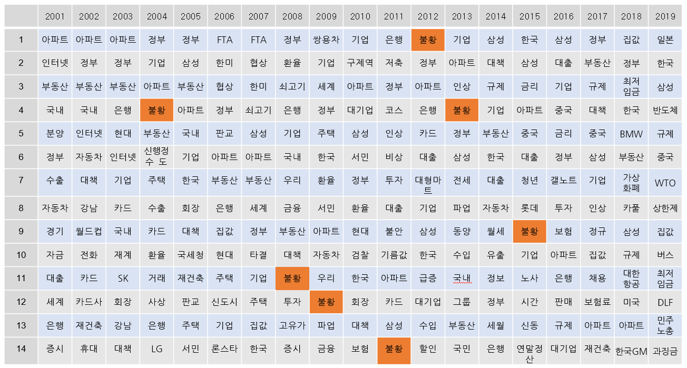
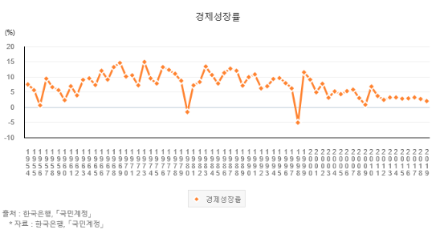

<<<<<<< HEAD
미디어는 한국 사회의 흐름을 압축적으로 담고 있는 Snapshot입니다. 지난 19년, 가장 대표적이고 강력한 미디어, **헤드라인 뉴스**로 한국 사회를 되돌아 볼까합니다.   

이번 포스팅은 사회 부분을 다뤄보겠습니다. SBS뉴스 사회 부분의 헤드라인 부분을 다 크롤링하여 문장을 단어별로 나눈 후 count 하였습니다.

-------

> #### Web Crawling 

R을 이용하여 크롤링을 하려고 할때 아래와 같은 라이브러리가 필요합니다.

```r
# 필요 패키지 설치
library(gsubfn)
library(stringr)
library(XML)
```

크롤링 함수는 아래와 같이 URL을 입력받아 긁어오도록 하였습니다.

```r
SBSnews <- function(url){
  doc <- htmlTreeParse(url, useInternalNodes = T, trim = T, encoding="utf-8") 
  rootNode <- xmlRoot(doc)
-
  xmlName(rootNode)
  names(rootNode)

  result <- xpathSApply(rootNode, "//strong[@class='spml_tit']", xmlValue)
  print(idx)
  return(result)
}
```

크롤링 기간은 아래와 같이 정하겠습니다. 저는 1년씩 하나씩 긁어서 1년 단위로 정리하겠습니다. 

```r
urlbase <- "http://news.sbs.co.kr/news/programMain.do?prog_cd=R1&broad_date="
Start <- as.Date("2018/01/01")
yyyy <- substr(Start, 1, 4)
End <- as.Date("2018/12/31")
list <- seq(from = Start, to = End, by=1) 
list2 <- format(list, format="%Y%m%d")
urlfinal<- str_c(urlbase,list2)
```

그리고 for문으로 Crawling 해줍니다.

```r
idx <- 1 ## 초기화
result <- as.character()

for(url in urlfinal){ 
  print(idx)
  result <- c(result,SBSnews(url))
  idx <- idx + 1
}
str(result)
```

크롤링한 데이터를 저장하기 전에 1차적으로 간단하게 전처리 해주고 파일을 저장합니다. 

```r
fulltitle <- gsub("[\r\t\n]", "", result) 

news_df <- data.frame(category = substr(fulltitle,1,2),
                      fulltitle = fulltitle,
                      stringsAsFactors = F) 
str(news_df)

idx <- as.numeric(which(news_df$category=="스포")) # Category가 "스포" -> "스포츠"로 변경

for(n in idx){
  news_df$category[n] <- "스포츠"
}

news_df$title <- substring(news_df$fulltitle,3)
for(n in idx){
  news_df$title[n] <- substring(news_df$fulltitle[n],4)
}

news_df2 <- subset(news_df, !grepl("*클로징*", news_df$title)) 
news_df2 <- subset(news_df2,news_df2$title != "오늘의 주요뉴스")
rownames(news_df2) <- 1:nrow(news_df2) 
nrow(news_df)-nrow(news_df2) 
```


------

> #### Keyword

파일을 저장 후 데이터를 따로 전처리를 끝내고 나면 아래와 같이 사회관련 뉴스 부분을 정리 할 수 있는데, 여기서 가장 많은 키워드는 아무래도 ..... 검찰과 경찰이겠죠?

<center></center>

그리고 주기적으로 보이는 키워드는 아무래도 날씨와 관련 있는 재해 부분 키워드 입니다. 

<center></center>

저 부분을 제외하면 중요해 보이는 키워드는 아래와 같습니다. 

<center></center>

잠깐만 봐도 해당 키워드들은 한 해를 떠들썩하게 했던 사건사고 키워드라는 것을 알 수 있습니다. 잊으면 안되는 2003년도 대구지하철 참사부터 2009년 신종플루 2010년 김길태, 천안함 사건, 2014년 세월호 등 많은 중요 키워드를 보고 한국 사회에서 일어난 모든 흐름을 알 수 있습니다. 

다음에는 경제 관련해서 얼마나 많은 일이 있었는지에 대해 알아보겠습니다. 
=======

저번 포스팅때는 한국 사회의 흐름을 알아보았는데요. 지난 19년을 되돌아보니 사건, 사고가 많았으며, 다시는 일어나면 안되는 사고들과 잊으면 안되는 일들이 많았습니다. 그럼 이번엔 경제를 되돌아보며 한국 경제에는 어떤 일들이 있었는지 알아보겠습니다. 그리고 크롤링은 저번에 했기 때문에 따로 다루지는 않겠습니다.


-------

> #### Keyword

사회와 마찬가지로 경제도 표를 만들면 아래와 같습니다. 우선 경제하면 가장 많이 떠오르는 것이 부동산이 아닐까 싶습니다.

<center></center>

역시나 부동산이나 재건축이 가장 많이 눈에 띄는 것이 보입니다. 2005년 국세청 키워드가 보이는데, 아마 종부제 시행으로 인해 많은 헤드라인을 장식했던 키워드 인것 같습니다. 

경제하면 기업들이 빼놓을 수 없는데, 아래와 같이 예전에 비해서는 갈수록 기업의 이름이 언급되는 걸로 보아 이제는 한국을 대표하는 기업이라고도 볼 수 있겠네요.

<center></center>


이번에는 직접적으로 한국에 영향을 끼쳤던 것이 무엇인지 알아보겠습니다. 아래와 같이 FTA, 광우병, 갤럭시 등을 볼 수가 있습니다. 

<center></center>


FTA나 광우병때는 제가 어려서(?) 뭔지 잘 몰랐었는데, 지금 보니 참 아이러니 했네요. 금융이나 기름값으로도 많은 문제가 있었던 해가 보이기도 하고 갤럭시 휴대폰이 터져서 문제가 되었던 2016년도 보입니다.   

<center></center>


경제 불황은 국제 부분과 함께 보면 좋겠지만, 우선 우리나라만 놓고 보면 2009년 이후로 경제 불황 키워드가 보이기 시작합니다. 실제 통계청에서도 경기 성장률 관련 지표를 찾아서 볼 수 있으며 아래와 같습니다. 

<center></center>

2008년 이후로 글로벌 금융 위기와 유럽 재정위기의 여파로 인해 세계 경기가 침체됨에 따라 한국의 성장률도 3%내외로 하락했고 장기적으로 성장률이 하락했다고 합니다. 일반적으로 보이는 현상이라고는 하는데, 그래도 이런 경제 침체는 없으면 좋겠습니다. 

이렇게 보니 나중에 2020년도때는 더 많은 경기 불황 키워드가 보이지 않을까 합니다. 코로나로 인해 많은 사람들이 피해를 보고 있는 이때, 모두들 잘 이겨냈으면 좋겠습니다. 
>>>>>>> 46b3ab82d866b56b34e00e881f3b232b3fd6fb92
