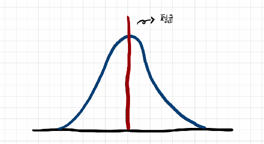
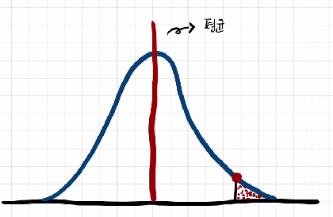
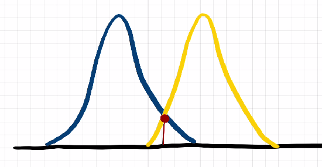
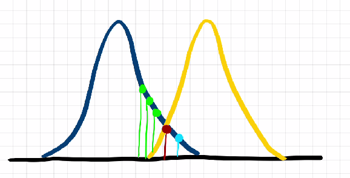
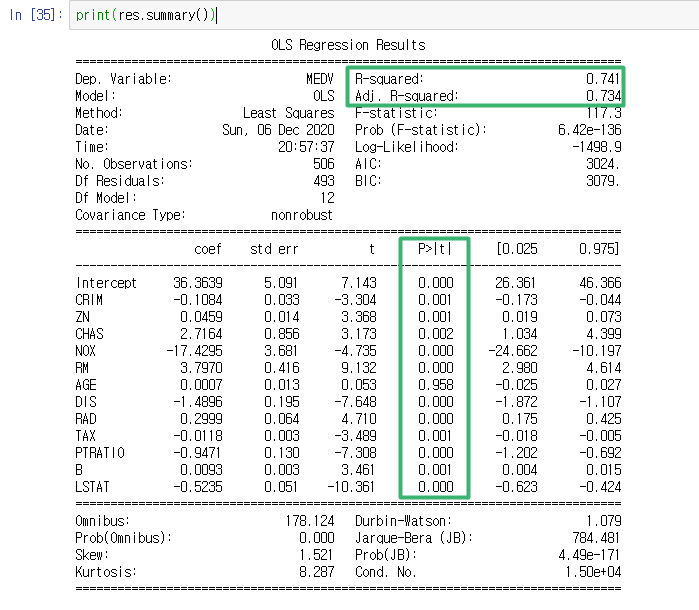

P-value에 대해 알기전에 귀무가설, 대립가설에 대해 알아야한다. 귀무가설은 표본 데이터를 사용하여 모집단에 대한 주장(귀무가설)의 타당성을 검정한다. 간단하게 말하면 어떠한 두 가지 현상 사이에 관계가 없다라고 이야기하는 일반적인 가설이다. 대립가설은 귀무가설과 반대로 내가 믿는 것, 실험이나 연구를 통해 입증하려고 하는 주장을 말한다. 이제 귀무가설, 대립가설에 대해 알았으니 P-value에 대해 알아보자.

-------

> #### What is P-value? 

아래와 같은 정규 분포가 있다고 하자.


<center></center>

P-value 값은 아래의 그림처럼 빨간색 점 오른족에 있는 값의 누적 확률이다. 빨간색 점에 해당하는 P-value값은 모집단 분포에서 무작위로 선택될 때, 빨간색 점의 오른쪽에 있는 값을 가져올 총 '확률'에 대해 알려준다. 

<center></center>


여기서 빨간점보다 더 오른쪽 값을 가져온다면, 샘플에서 얻은 결과는 모집단 분포의 극단이므로 다른 분포에 속할 가능성이 높다고 이야기 할 수 있다. 

그렇다면 귀무가설과 대립가설은 P-value와 무슨 관계가 있을까 ? 

* P-value가 높다면 귀무가설을 잘 따르고 있다 
* P-value가 (예:0.05 보다) 작다면 귀무가설을 잘 따르고 있지 않다. 

<center></center>

그래서 이렇게 두 정규분포에서 빨간점을 임계 값 P-value(0.05)라고 할 때, 아래 그림과 같이 하늘색 점을 선택하게 된다면, P-value보다 작기 때문에 귀무가설에 잘 따르고 있지 않다고 볼 수 있다. 

<center></center>

> #### P-value에 대한 잘못된 해석

가끔 P-value에 대한 해석을 잘못하는 사람들이 있다. 일반적으로 많이 하는 실수에 대한 일부를 이야기 해볼까한다. 

P-value는 결과가 통계적으로 유의할 때, 대립가설에 대한 도전, 혹은 믿음을 주는 도구로 사용할 수 있다. 쉽게 애기하면 P-value는 전체 의사 결정과정의 작은 부분에만 도움이 되는 것이지, 실질적인 의사결정을 내려서는 안된다. 또한 절대적인 지표가 아님을 명심해야 한다. 

P-value는 두 집단간에 차이가 있는지 없는지 정도로만 알려주기 때문에 주의 해야한다. 


> #### Python code

보스턴 데이터를 사용해서 P-value를 구현해볼까한다.


```python
import statsmodels.formula.api as smf
from sklearn.datasets import load_boston

boston = load_boston()
boston_data = pd.DataFrame(boston.data, columns=boston.feature_names)
boston_data['MEDV'] = boston.target

res = smf.ols(formula='MEDV ~CRIM + ZN + CHAS + NOX + RM + AGE + DIS + RAD + TAX + PTRATIO + B + LSTAT', data=boston_data).fit()
print(res.summary())
```

statsmodels 라이브러리를 이용해서 쉽게 P-value를 구할 수 있다. 

<center></center>

이 테이블은 독립 변수에 대한 모든 통계를 표시한다. 일단 중요한 건 아니니 전부 넘기고 P-value만 보도록 하자.
위에서도 귀무가설과 대립가설에 대해 이야기 했지만, 회귀모델에서 P-value 값이 무엇을 의미하는지를 정리하면 아래와 같이 정리할 수 있다.  

* 귀무가설 : 독립변숙 종속변수에 대해 유의한 영향을 미치지 않는다.
* 대립가설 : 독립변수는 종속변수에 중요한 영향을 미친다. 

통상적으로 0.05이하인 경우 통계적으로 유의하다라고 판단한다. 그런데, 표에서 AGE 값이 0.95다. 이뜻은 AGE 변수는 Target에 영향을 주는 변수라고 볼 수 없다. 

여기서 해당 변수를 제거하고 다시 OLS모델을 만들면 R-squared가 올라가는 것을 알 수 있는데, 더 성능이 좋은 모델을 만들어짐을 볼 수 있다. 

이렇게 P-value의 도움으로 더 적은 변수로 간단하게 모델을 만들 수 있다. 

