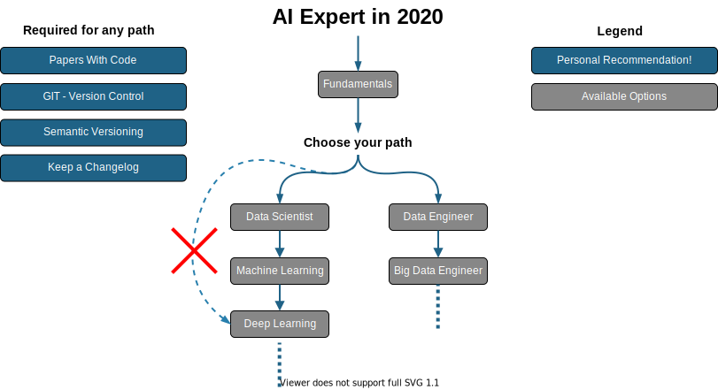
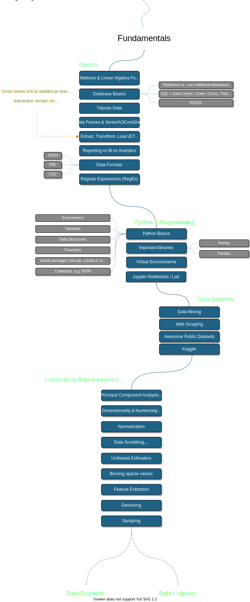
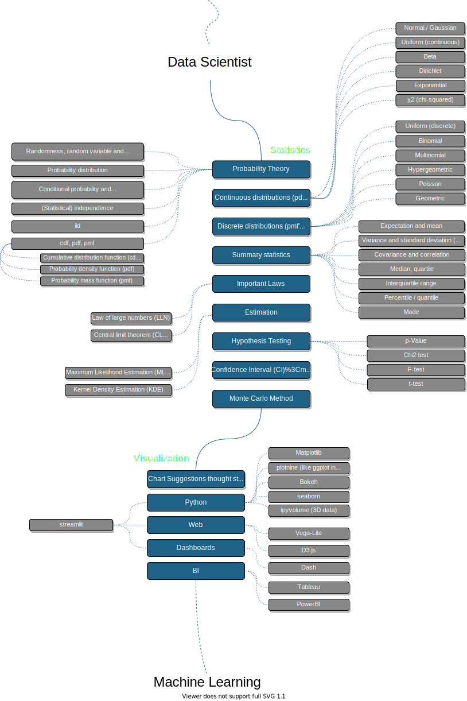
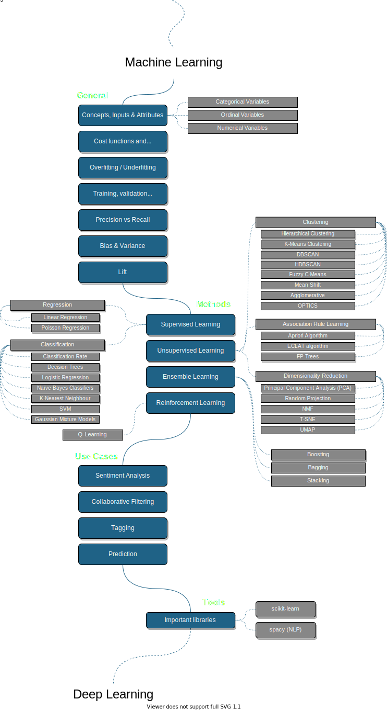

이제 3년차 머신러닝 개발자로 들어서고 있는 시점에 나는 내가 가지고 있는 역량이나 방향이 제대로 가고 있는지에 대해 또는 무엇을 더 공부해야 되는지에 대해 의문을 가졌다. 그리고 한 GitHub에서 [AI 개발자 로드맵]((https://github.com/AMAI-GmbH/AI-Expert-Roadmap/))을 발견했고 이것을 참고하여 조금 더 공부해볼까한다. 로드맵은 언제든 바뀔 수 있으므로 최신버전을 보고 싶다면 [링크]((https://github.com/AMAI-GmbH/AI-Expert-Roadmap/)를 타고 확인하기를 바란다. 

----------

> #### Introduction

      

> #### Fundamentals

      

> #### Data Science Roadmap

      

> #### Machine Learning Roadmap

      

> #### Deep Learning Roadmap

      

> #### Data Engineer Roadmap

      

> #### Big Data Engineer Roadmap

      

물론 정답이라는 보장은 없지만 그래도 방향 잡는데에 도움이 많이 되는 것 같다. 