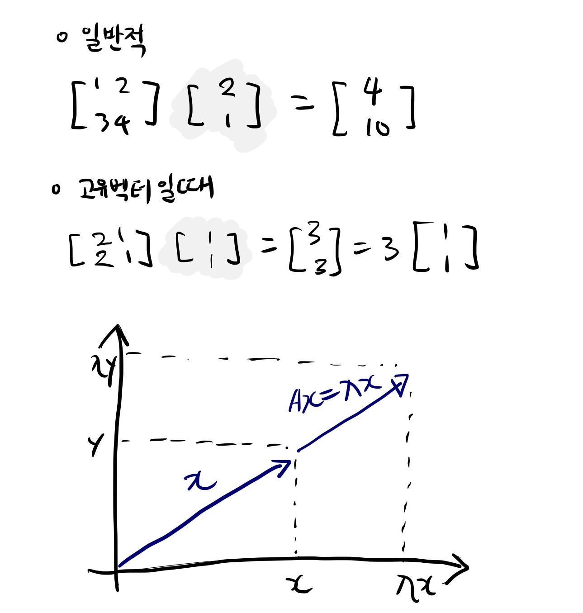

고유값과 고유벡터에 대해서 많이 들어봤을 것이다. 그만큼 무척 중요하다고 모두들 이야기한다. 이번에 새롭게 공부하기 시작하면서 고유값과 고유벡터가 무엇인지, 왜 중요한지에 대해 정리해보려고 한다. 

---------  

> #### 고유값, 고유벡터란?  

정방행렬에 정방행렬의 고유벡터를 곱하면 고유벡터의 방향이 바뀌지 않는다. 일반적으로 벡터 x에 어떤 행렬 A를 곱하게 되면 벡터의 크기와 방향이 바뀌게 된다. 그러나 벡터x가 행렬 A의 고유벡터라면 바뀌지 않는다.

즉, 벡터 x에 어떠한 N차 정사각형 행렬A에 행렬연산을 취하게 되었을 때, 변화 결과가 자기 자신의 상수배가 되는 0이 아닌 벡터를 고유벡터, 상수배 값을 고유값이라고 이야기한다. 

